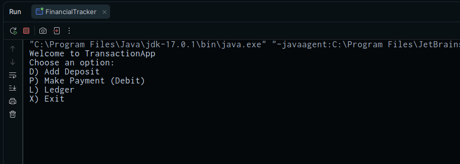
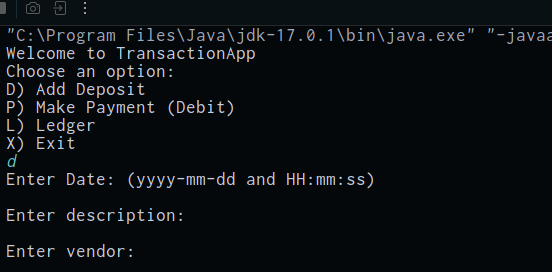
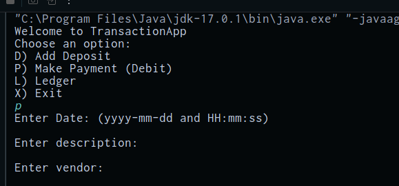
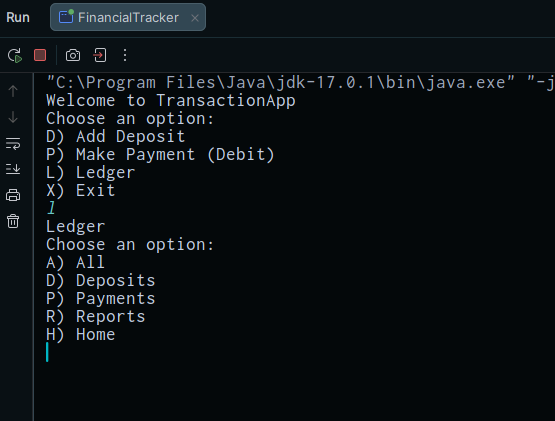
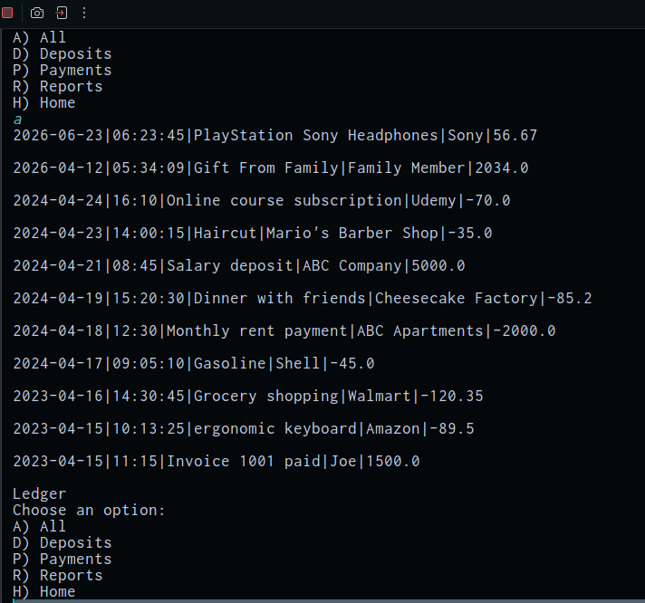
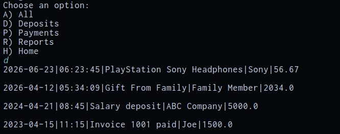
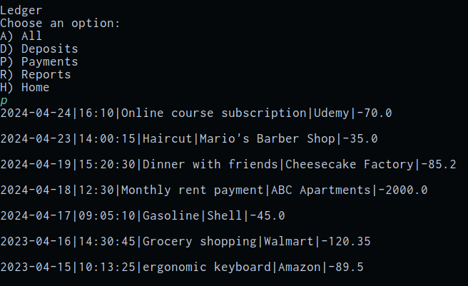
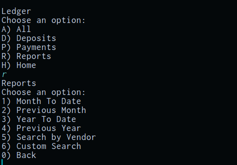

# Accounting Ledger Application

## Description of the Project

FinancialTracker is a java application for individuals who want a simple way to track their personal transactions. The intended users are anyone who wants to 
record and review their income and expenses without needing a complex tool. This java application allows the user to record deposits and payments to a csv file,
view their full transaction history and, filter transactions by deposits or payment. Furthermore, you can filter by dates; month to current date, the 
previous month, current year to current date and, previous year. Also, you can search by vendor.

This app aims to solve the problem of keeping a simple and organized way to track personal transactions through this app and the csv file.

## User Stories

- As a user, I want to see a home screen menu, so that I can choose what I want to do in the app.
- As a user, I want to be able to load my past transactions when the app starts, so that I can see my previous history.
- As a user, I want to be able to add a deposit, so that I can save deposit records to the CSV file.
- As a user, I want to be able to make a payment, so that I can record debit transactions to the CSV file.
- As a user, I want to view all ledger entries, so that I can see my full transaction history.
- As a user, I want to filter the ledger by deposits, so that I can see only money added to my account.
- As a user, I want to filter the ledger by payments, so that I can see only money that was spent.
- As a user, I want to run a Month-To-Date report, so that I can view all transactions from this month.
- As a user, I want to run a Previous Month report, so that I can review last month's transactions.
- As a user, I want to run a Year-To-Date report, so that I can see all transactions this year.
- As a user, I want to run a Previous Year report, so that I can review all transactions from last year.
- As a user, I want to search transactions by vendor, so that I can see all entries for a specific vendor.
- As a user, I want to navigate back from any screen, so that I can move freely through the app.
## Setup

Instructions on how to set up and run the project using IntelliJ IDEA.

### Prerequisites

- IntelliJ IDEA: Ensure you have IntelliJ IDEA installed, which you can download from [here](https://www.jetbrains.com/idea/download/).
- Java SDK: Make sure Java SDK is installed and configured in IntelliJ.

### Running the Application in IntelliJ

Follow these steps to get your application running within IntelliJ IDEA:

1. Open IntelliJ IDEA.
2. Select "Open" and navigate to the directory where you cloned or downloaded the project.
3. After the project opens, wait for IntelliJ to index the files and set up the project.
4. Find the main class with the `public static void main(String[] args)` method.
5. Right-click on the file and select 'Run 'YourMainClassName.main()'' to start the application.

## Technologies Used

- Java 17

## Demo

Starting menu:
- 
- Add deposit:
- 
- Add payment:
- 

Ledger menu:

- 
- All option in ledger:
- 
- Deposits in ledger menu:
- 
- Payments in Ledger menu:
- 
- Reports in the Ledger menu:
- 

## Future Work
Custom Search 

Insert a feature that would allow users to search transactions using any combination of filters including date range, description, vendor, and exact amount.

## Resources

- [Java Visual Learning Hub](https://raymaroun.github.io/yearup-java-visuals/)
- [Java W3 Schools](https://www.w3schools.com/java/default.asp)
- [GeekforGeeks](https://www.geeksforgeeks.org/java/java/)

## Thanks

- Thank you to Raymond for continuous support and guidance.
- Thank you to my peers for support

 